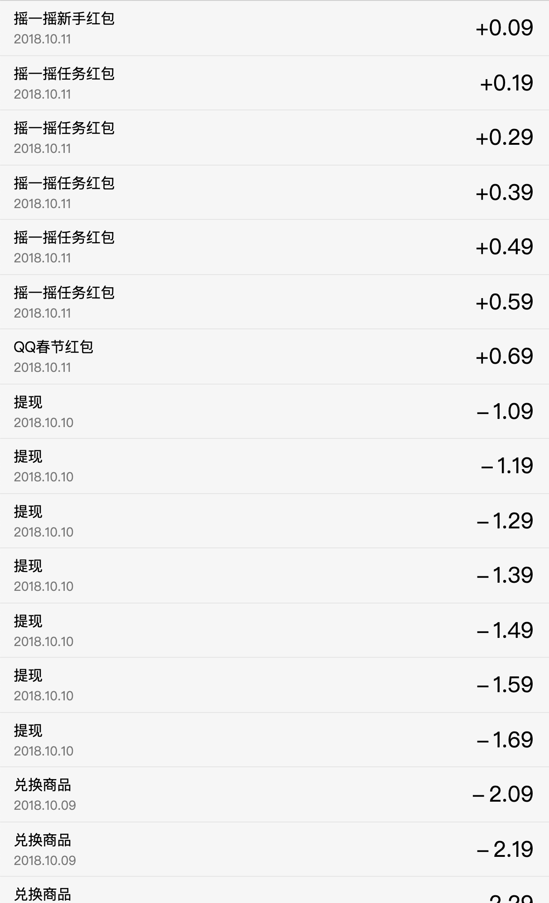
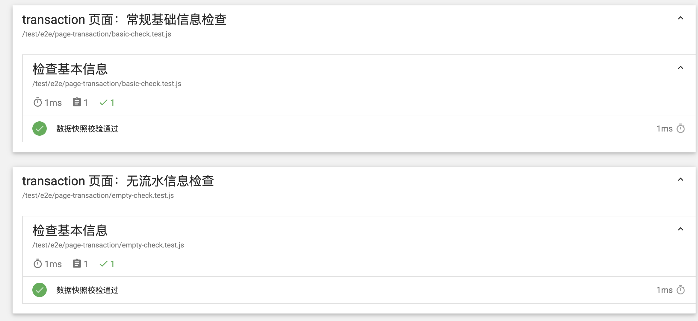

# 04. 单一接口展示型页面

## 1. 测试概述

> 在本部分，我们将通过一个例子查看 `matman` 是如何通过自动化测试测试接口的。

### 1.1 结果展示

我们使用一个单一的列表进行演示，加载数据之后的页面效果如下图所示：



### 1.2 测试思路

- 我们主要的目的是通过页面的数据快照展示接口正常工作
- 我们的测试思路如下：
  - 首先测试在未获取数据时，页面中不存在数据
  - 在获取数据之后，我们通过白盒测试的思想，模拟测试数据，并且预期其输出

接下来我们进入下一部分，详细的看看如何进行具体测试样例的编写。

## 2. 测试样例的设计

> - matman 项目的主要结构我们已经了解了，可以直接[参考](https://github.com/matmanjs/matman-demo)
> - 本节我们将会详细介绍测试样例的编写，不再关注 matman 页面爬虫等

我们在页面中获取到的数据有下面的几项：

- 无项目时的提示：emptyWording
- 项目的总数：total
- 项目的具体项目：list

接下来，我们主要对比这几项即可。

### 2.1 未获取数据

```js
describe('检查基本信息', function () {
  let data;
  before(function () {
    data = resultData.data;
  });
  
  it('数据快照校验通过', function () {
    expect(data).to.eql({
      'transactionListInfo': {
        // 'emptyPic': 'http://now.qq.com/img/nopkdata@2x_c3c9fbba.png',
        'emptyWording': '暂无流水记录',
        'isExist': true,
        'list': [],
        'total': 0
      }
    });
  });
});
```

我们期望在未获取数据时：

- emptyWording：暂无流水记录
- list：空数组
- total：0

这是我们预期的数据的数据，我们从页面爬虫获取的数据也应该如此。

### 2.2 获取数据

在获取数据之后我们的对应字段要发生变化，我们只要验证变化与我们的白盒测试的期望样例一致即可：

```js
describe('检查基本信息', function () {
  let data;
  
  before(function () {
    data = resultData.data;
  });
  
  it('数据快照校验通过', function () {
    expect(data).to.eql({
      'transactionListInfo': {
        // 'emptyPic': '',
        'emptyWording': '',
        'isExist': true,
        'list': [{
          'id': 'id_1_1539224581000_6',
          'isExist': true,
          'isExpire': false,
          'money': '+0.09',
          'name': '摇一摇新手红包',
          'time': '2018.10.11'
          },...],
          'total': 28
       }
    });
  });
});
```

我们期望在获取数据后：

- emptyWording：空字符串
- list：对象数组
- total：28

这是我们预期的数据的数据，我们从页面爬虫获取的数据也应该如此。

### 3.3 总结

通过上面的过程我们可以看到，我们可以通过白盒测试验证获取数据前后不同的页面数据快照，得出接口是否正常工作的结论。

### 3. 测试结果

