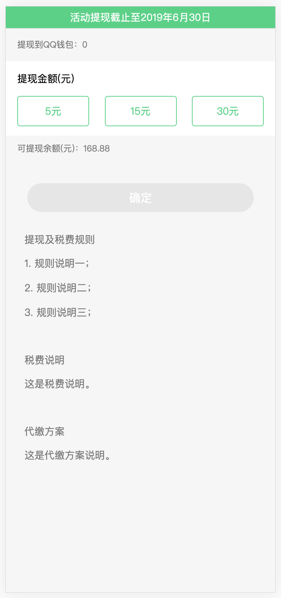
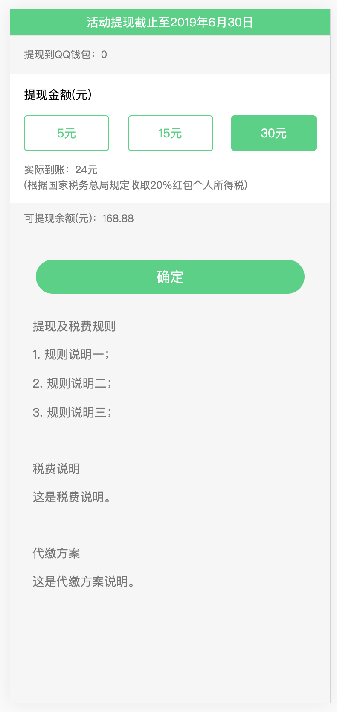
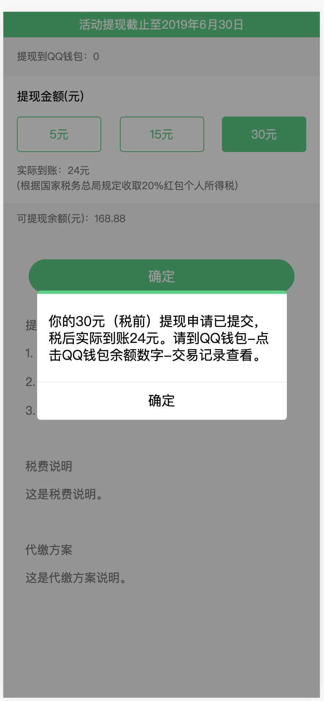
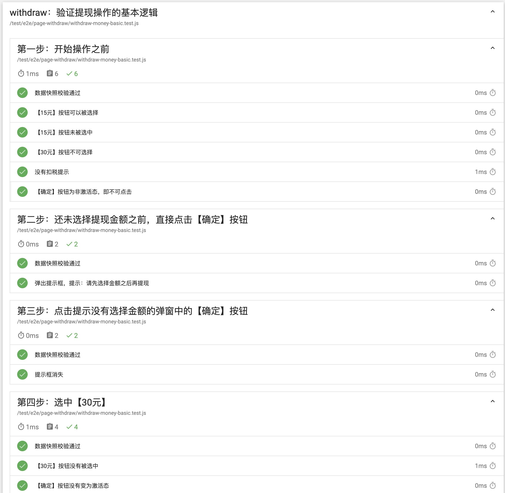

# 05. 重交互型页面

## 1. 测试概述

> 在本部分，我们将通过一个例子查看 `matman` 是如何通过自动化测试测试接口的工作情况的。

### 1.1 结果展示

我们使用一个单一的展示型列表进行演示，加载数据之后的页面效果如下图所示：



选择提现金额后页面如下：



点击确定按钮后页面如下：



### 1.2 工作流程

我们可以将页面的工作流程总结为下图：



### 1.3 测试思路

- 这是典型的多流程、多分支的案例场景
- 可以应用基于场景的测试案例设计方法
- 我们同样关注每一步操作之后的页面数据快照，并用过它来进行自动化测试

## 2. 测试样例的设计

> - matman 项目的主要结构我们已经了解了，可以直接[参考](https://github.com/matmanjs/matman-demo)
> - 本节我们将会详细介绍测试样例的编写，不再关注 matman 页面爬虫等（根据每个页面自身的结构编写即可）

### 2.1 测试样例设计

> - matman 中测试样例的设计，不同于单纯的界面测试，也不同于单纯的功能测试
> - 而是基本涵盖了这两部分的工作
> - 在编写代码部分我们只选取具有代表性的代码进行分析，详细测试代码可以[参考](https://github.com/matmanjs/matman-demo)

#### 2.1.1 基本检查设计

界面的设计检查：

- 已经提现金额、实际到账金额的正确展示
- 提现规则的正确展示
- 按钮的可点击性测试
  - 提现金额大余额可点击
  - 已经选择提现金额可点击确定

#### 2.1.2 场景流的设计

业务流程设计如下：

|           流程           |                           流程描述                           |
| :----------------------: | :----------------------------------------------------------: |
|     基本流1（路径）      | 1. 用户正确登录（测试中表现为手动设置 cookie）<br />2. 用户选择提现金额<br />3. 用户点击确定按钮<br />4. 用户点击弹框中的确定按钮<br />5. 成功跳转界面 |
| 备选流1-用户账户余额不足 | 在基本流 2 中，会检查用户选择的提现金额是否大于账户余额，如果小于则不能选择，并且回到基本流 2 |
|    备选流2-活动不存在    | 在基本流 4 中，会检查用户时候提现成功，如果提现未成功显示活动不存在，并且回到基本流 2 |
|     备选流3-活动结束     | 在基本流 4 中，会检查用户时候提现成功，如果提现未成功显示活动结束，并且回到基本流 2 |
|   备选流4-达到提现次数   | 在基本流 4 中，会检查用户时候提现成功，如果提现未成功显示达到提现次数，并且回到基本流 2 |
|    备选流5-无提现名额    | 在基本流 4 中，会检查用户时候提现成功，如果提现未成功显示无提现名额，并且回到基本流 2 |

场景设计如下：

|        场景        |  基本流  |  备选流  |
| :----------------: | :------: | :------: |
|   场景1-提现成功   | 基本流 1 |    /     |
|   场景2-余额不足   | 基本流 1 | 备选流 1 |
|  场景3-活动不存在  | 基本流 1 | 备选流 2 |
|   场景4-活动结束   | 基本流 1 | 备选流 3 |
| 场景5-达到提现次数 | 基本流 1 | 备选流 4 |
|  场景6-无提现名额  | 基本流 1 | 备选流 5 |

测试样例设计如下：

|  场景  | 余额不足 | 活动不存在 | 活动结束 | 达到提现次数 | 无提现名额 |
| :----: | :------: | :--------: | :------: | :----------: | :--------: |
| 场景 1 |    N     |     N      |    N     |      N       |     N      |
| 场景 2 |    V     |     /      |    /     |      /       |     /      |
| 场景 3 |    V     |     V      |    /     |      /       |     /      |
| 场景 4 |    V     |     /      |    V     |      /       |     /      |
| 场景 5 |    V     |     /      |    /     |      V       |     /      |
| 场景 6 |    V     |     /      |    /     |      /       |     V      |

接下来我们针对这两个测试的类型分别编写测试代码

### 2.2 UI 测试

```js
describe('检查基本信息', function () {
  let data;
  before(function () {
    data = resultData.data;
  });
  
  it('数据快照校验通过', function () {
    expect(data).to.eql({...});
  });
  
  it('【5元】按钮可被选择', function () {
    expect(data.withdrawInfo.quota0.isAvailable).to.be.true;
  });
  
  it('【15元】按钮可被选择', function () {
    expect(data.withdrawInfo.quota1.isAvailable).to.be.true;
  });
  
  it('【30元】按钮不可选择', function () {
    expect(data.withdrawInfo.quota2.isAvailable).to.be.false;
  });
});
```

我们通过获取余额为 `23.3元` 的数据验证提现金额按钮的可被点击情况。

```js
describe('检查接口请求及数据上报等情况', function () {
  it('请求了 get_balance 接口（获取余额信息）', function () {
    const result = resultData.isExistXHR('//cgi.now.qq.com/cgi-bin/a/b/get_balance', {
      activeid: 10001
    }, 200);
    
    expect(result).to.be.true;
  });
  
  it('请求了 get_verify_status 接口（获取认证状态）', function () {
    const result = resultData.isExistXHR('//cgi.now.qq.com/cgi-bin/a/b/get_verify_status', {}, 200);
    expect(result).to.be.true;
  });
  
  it('上报了页面曝光', function () {
    const result = resultData.isExistXHR('/maybe/report/pv', {
      report_id: 987
    }, 200);
    
    expect(result).to.be.true;
  });
});
```

通过上面的代码，我们可以验证接口的请求情况。只需向 `isExistXHR` 函数传入对应的 URL即可得到是否存在这一请求。

### 2.2 基于流的测试

```js
describe('第三步：点击【确定】按钮', function () {
  let data;
  
  before(function () {
    data = resultData.get('clickSubmit');
  });
  
  it('弹出提示框，提示成功', function () {
    expect(data.alertInfo.content).to.equal('该活动不存在，请重新加载');
  });
  
  it('请求了 withdraw_money 接口（提现接口）', function () {
    const result = resultData.isExistXHR('//cgi.now.qq.com/cgi-bin/a/b/withdraw_money', {
      activeid: 10001,
      amount: 500
    }, 200);
    
    expect(result).to.be.true;
  });
});
```

在这里我们只选择场景三为大家做一个展示：

- 在点击确定按钮之后，如果无法提现会弹出提示框，我们只需要验证提示框的内容即可
- 其他场景的验证是类似的，在这里我们就不再赘述了

### 3.3 总结

通过上面的过程我们可以看到，我们可以通过白盒测试验证获取数据前后不同的页面数据快照，得出页面与交互是否正常工作的结论。

## 3. 测试结果

